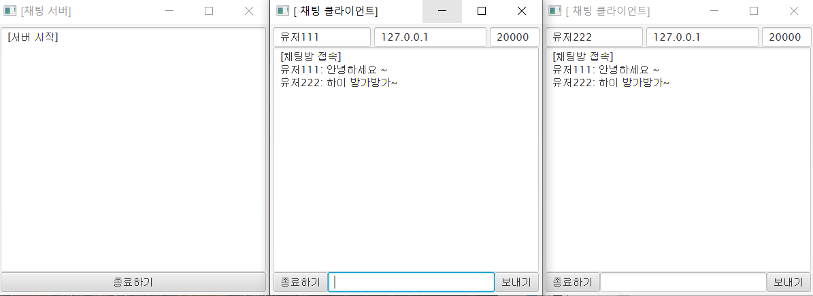

# JavaFx

### JavaFx Basic.java
- JavaFx 기초 연습 파일 코드

### JavaFx ChatProgram
- JavaFx를 이용한 채팅 프로그래밍이다.
- 접속 인원수의 제한은 업으며 ChatServer.java 코드를 실행시킨뒤 ChatClient.java 코드를 실행시킬 것

### 서버
- ChatServer_API.java / ChatServer.java

### 클라이언트 
- ChatClient.java

   
### 프로그램 실행화면

